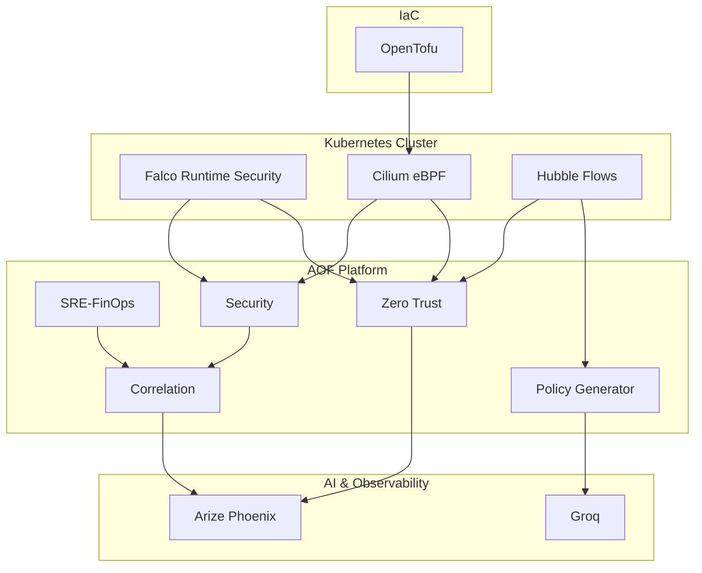

#  AOF

AI Operations Framework for Kubernetes Security

Multi-agent platform combining eBPF telemetry, Zero Trust analysis,
LLM-driven policy generation and Infrastructure as Code.

    AOF continuously evaluates Kubernetes runtime security posture using
specialized agents that consume Falco alerts, Cilium policies and Hubble
network flows to generate Zero Trust assessments and remediation plans.

## Highlights

- 5 specialized A2A agents
- Real Falco runtime alerts
- Cilium + Hubble flow analysis
- OpenTofu managed security controls
- Arize Phoenix observability
- LLM-as-Judge evaluation pipeline
- Automated NetworkPolicy generation

## Results

| Metric | Result |
|----------|----------|
| Zero Trust Score | 95/100 |
| Network Policies | 26 |
| Falco Noise Reduction | 42% |
| API Violations Reduction | 72% |
| Monthly LLM Cost | ~$5.38 |

## Stack

Runtime Security
- Falco

Network Security
- Cilium
- Hubble

AI
- Groq
- BeeAI

Observability
- Phoenix
- OpenTelemetry

Infrastructure
- OpenTofu

Platform
- Kubernetes
- Python

estrutura

aof/

├── sre-agent/
├── security-agent/
├── correlation-agent/
├── zero-trust-agent/
├── cilium-policy-agent/

├── infrastructure/
├── observability/

├── orchestrator.py

└── start-all.sh

